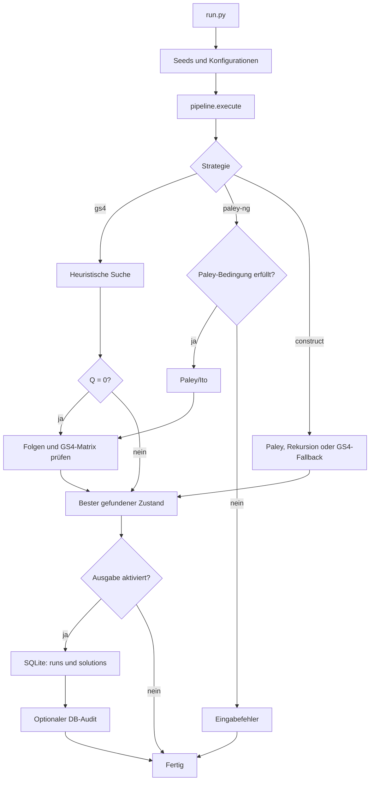

# Hadamard-668

[](https://python.org)

CPU-basierte Suche nach reellen Hadamard-Matrizen in der negazyklischen
Goethals-Seidel-Familie. Das konkrete Fernziel ist eine Matrix der Ordnung 668,
also vier binäre Folgen der Länge `n = 167`.

## Projektstatus

Für Ordnung 668 wurde keine Matrix gefunden. Der heuristische Solver löst
kleinere GS4-Instanzen und speichert seine Ergebnisse reproduzierbar in SQLite.
Der versionierte Katalog enthält derzeit 794 verifizierte Lösungen aus 794
Quick-Orbits für `n = 31` bis `n = 64`.

`n = 52` ist kein ungelöstes Konstruktionsproblem: Weil `2n - 1 = 103` prim
ist, erzeugt der implementierte Paley/Ito-Pfad deterministisch eine Matrix der
Ordnung 208. Heuristische Lösungen für dieselbe Länge werden im Katalog davon
getrennt ausgewiesen.

## Installation

```bash
git clone <repo-url>
cd hadamard-668
python -m pip install -e ".[dev]"
```

## Schnellstart

Ein heuristischer Lauf ohne Datenbankausgabe:

```bash
python run.py --strategy gs4 --order 128 --candidate-budget 6000000 --seed 42 --no-output
```

Ein paralleler Sweep über mehrere Sequenzlängen:

```bash
python run.py --sweep gs4 32 34 36 --seeds 100 --candidate-budget 6000000 --workers 12
```

Die exakte Paley/Ito-Konstruktion für Ordnung 208:

```bash
python run.py --strategy paley-ng --order 208 --no-output
```

Eine vorhandene Datenbank read-only prüfen:

```bash
python run.py --check data/hadamard.db
```

## Modell

Vier Folgen `a, b, c, d` aus `{+1, -1}^n` bestimmen vier negazyklische
Blöcke und daraus eine GS4-Matrix `H` der Ordnung `4n`. Die
Hadamard-Bedingung ist äquivalent zu

```text
NAF_a(t) + NAF_b(t) + NAF_c(t) + NAF_d(t) = 0
für t = 1, ..., n - 1.
```

Der Tracker speichert nur die unabhängigen, durch vier geteilten Residuen
`u`. Seine Zielfunktion ist `Q = ||u||²`; die im Repository verwendete
Gram-Energie ist `E = 64nQ`. `Q = 0` ist exakt die GS4-Bedingung.

Die vollständige Herleitung steht in
[`docs/mathematics.md`](docs/mathematics.md).

## Systemfluss



Jeder abgeschlossene Lauf kann in `runs` gespeichert werden. Nur ein
Nullenergie-Kandidat wird im Pipelinepfad unabhängig geprüft und zusätzlich in
`solutions` übernommen. Die lokale Datei `data/hadamard.db` ist absichtlich
nicht versioniert.

## Dokumentation

- [`docs/mathematics.md`](docs/mathematics.md): GS4-Gleichung, Energie,
  Flip-Algebra und Tight-Frame-Struktur.
- [`docs/solver.md`](docs/solver.md): aktueller Suchalgorithmus, Defaults,
  Budget und Kontrollfluss.
- [`docs/constructions.md`](docs/constructions.md): implementierte exakte
  Konstruktionen und tatsächlicher `construct`-Dispatcher.
- [`docs/experiments.md`](docs/experiments.md): Datenmodell, Identitäten,
  Metriken und Reproduktionsvertrag.

Der Einstieg und die Quellenhierarchie stehen in
[`docs/README.md`](docs/README.md).

## Qualität

```bash
python scripts/quality.py check
```

Der Check umfasst Ruff, Pyright, pytest und `compileall`. Lang laufende
Mutationstests werden separat mit `python scripts/quality.py mutate` gestartet.

## Literatur

- J. M. Goethals und J. J. Seidel, *A skew Hadamard matrix of order 36*,
  [doi:10.1017/S144678870000673X](https://doi.org/10.1017/S144678870000673X)
- N. A. Balonin und D. Z. Djokovic, *Negaperiodic Golay pairs and Hadamard
  matrices*, [arXiv:1508.00640](https://arxiv.org/abs/1508.00640)
