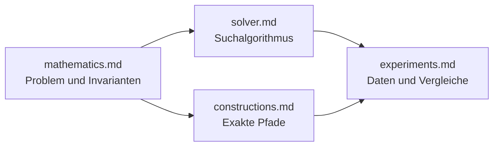

# Dokumentation

Diese Dokumentation beschreibt den aktuellen Checkout. Historische
Laborjournale, verworfene Solvervarianten und Ergebnisse ohne erhaltene
Rohartefakte gehören nicht zum kanonischen Bestand.

## Lesereihenfolge

1. [`mathematics.md`](mathematics.md) definiert das GS4-Problem und die exakte
   Zielfunktion.
2. [`solver.md`](solver.md) erklärt, wie der aktuelle Solver diese Zielfunktion
   durchsucht.
3. [`constructions.md`](constructions.md) trennt die exakten Konstruktionen von
   der heuristischen Suche.
4. [`experiments.md`](experiments.md) beschreibt Speicherung, Metriken und
   reproduzierbare Auswertung.

## Quellenhierarchie

Bei einem Widerspruch gilt folgende Reihenfolge:

1. Mathematische Akzeptanzkriterien werden durch `src/builder.py` und
   `src/verify.py` festgelegt.
2. Solververhalten und Budgetsemantik werden durch `src/solver.py`,
   `src/tracker.py` und `src/models.py` festgelegt.
3. Persistenz und Identitäten werden durch `src/output.py` und
   `src/canonical.py` festgelegt.
4. Ergebniszahlen müssen aus einem erhaltenen Artefakt stammen. Im Repository
   ist das `data/gs4_solution_catalog_v1.json`; lokale Datenbanken und Dateien
   unter `runs/` sind nicht versioniert.

Abgeleitete Formeln stehen in `mathematics.md` zusammen mit ihrem
Gültigkeitsbereich und den zugehörigen Regressionstests. Eine niedrigere
Energie, ein schnellerer Einzellauf oder eine größere Zahl akzeptierter Moves
ist für sich allein kein Beleg für einen besseren Solver.

## Notation

`n` ist die Länge jeder der vier binären Folgen. Die resultierende Matrix hat
Ordnung `4n`. `r` bezeichnet das kombinierte negaperiodische Residuum,
`u = r/4` seine reduzierte Form, `Q = ||u||²` die Solverzielfunktion und
`E = 64nQ` die im Repository verwendete Gram-Energie.
