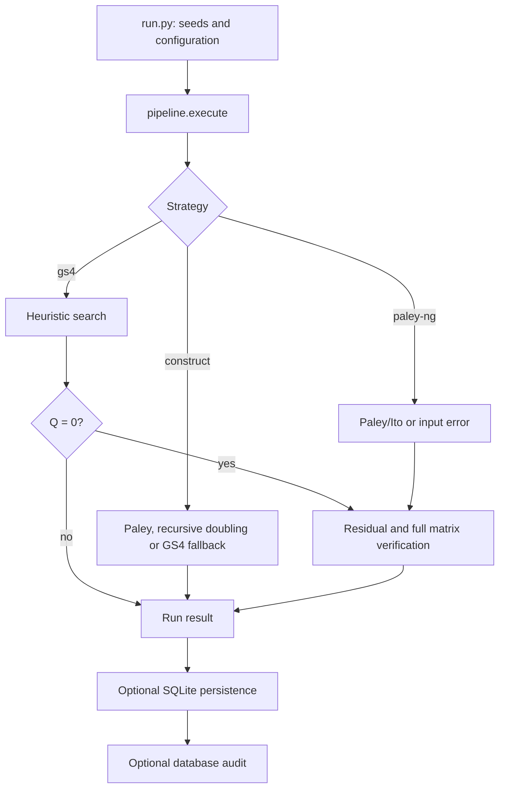

# Architecture

Parent: [Documentation index](README.md)

## Contents

- [Architecture](#architecture)
  - [Contents](#contents)
  - [Execution flow](#execution-flow)
  - [Ownership](#ownership)
  - [Acceptance boundary](#acceptance-boundary)

## Execution flow

The `construct` dispatcher verifies a successful candidate before returning it;
its detailed control flow and budget caveat are in [Constructions](constructions.md).

## Ownership

| Module | Responsibility |
| --- | --- |
| `run.py` | CLI, workers, progress, output and database audit |
| `src/models.py` | Domain values, budgets, configuration and result records |
| `src/generator.py` | Strategies and initial states |
| `src/pipeline.py` | End-to-end execution and acceptance boundary |
| `src/tracker.py` | Exact search energy and incremental flip caches |
| `src/solver/` | Search orchestration and independently replaceable phases |
| `src/constructions.py` | Canonical exact sequence constructions |
| `src/builder.py` | Pure GS4 matrix construction |
| `src/verify.py` | Residual, matrix and database verification |
| `src/canonical.py` | Exact and quick-orbit state identities |
| `src/output.py` | SQLite persistence and migration |
| `src/solution_analysis.py` | Versioned solution features and catalog analysis |

The [solver package](solver.md#implementation-boundaries) separates orchestration,
phase policy, working state and tracing. Its public entry point remains
`from src.solver import search, SolverConfig`.

The combined `lab.interleaving` research module uses canonical constructions and
verification. It is outside the search pipeline; see [Laboratory](laboratory.md).

## Acceptance boundary

The search operates on four binary sequences, not a full matrix. A zero-energy
candidate must pass independent verification before the pipeline accepts it as a
solution: validate the sequence equations, build the matrix, then check row norms
and pairwise orthogonality.

An unsolved best state remains a useful run record. It is not a Hadamard matrix.
The database audit checks stored payloads and identities without rebuilding every
matrix; see [Experiments](experiments.md) for its exact contract.
