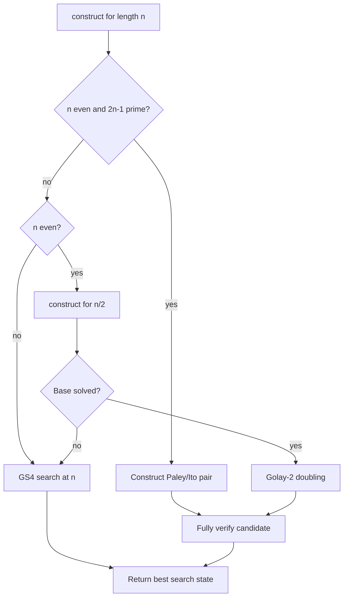

# Exact constructions

Parent: [Documentation index](README.md)

Construction and search are separate paths. An exact construction produces
sequences with `Q = 0` without invoking the heuristic solver. The pipeline
still checks the result against the same acceptance criteria as a solution
found by search.

## Contents

- [Exact constructions](#exact-constructions)
  - [Contents](#contents)
  - [Strategies](#strategies)
  - [Paley/Ito path](#paleyito-path)
  - [Turyn product](#turyn-product)
  - [Golay-2 doubling](#golay-2-doubling)
  - [The construct dispatcher](#the-construct-dispatcher)
  - [Recursive budget limitation](#recursive-budget-limitation)
  - [Verification](#verification)
  - [References](#references)

## Strategies

| Strategy | Behavior |
| --- | --- |
| `gs4` | Always uses heuristic search |
| `paley-ng` | Direct Paley/Ito construction or an input error |
| `construct` | Direct Paley/Ito construction, recursive doubling, or search |

`--order` specifies the matrix order `4n`. In contrast, `--sweep` expects the
sequence length `n`.

## Paley/Ito path

The implemented prime-field case applies exactly when

```math
n>0,
\qquad
n \text{ is even},
\qquad
p=2n-1 \text{ is prime}.
```

`paley_ng_sequences(n)` deterministically constructs a negaperiodic Golay
pair `(a, b)` and returns the GS4 tuple

```math
(a,b,a,b).
```

The seed, initial state, and candidate budget have no effect on this path.
The regression tests cover `n = 52`, `p = 103`, yielding a Hadamard matrix
of order 208.

```bash
python run.py --strategy paley-ng --order 208 --no-output
```

The implementation supports only the prime case `p = 2n - 1`. General prime
powers are not implemented.

## Turyn product

Let `(g, h)` be an ordinary Golay pair and `(c, d)` a suitable negaperiodic
pair. With

```math
g_+ = \frac{g+h}{2},
\qquad
g_- = \frac{g-h}{2}
```

`turyn_pair()` computes

```math
e = c\otimes g_+ + d^R\otimes g_-,
```

```math
f = d\otimes g_+ - c^R\otimes g_-.
```

`turyn_gs4()` applies the same factor separately to the pairs `(a, b)` and
`(c, d)` of a GS4 tuple.

The generic functions check the shape and binary output. They do not prove
that the first factor is a Golay pair or that the input tuple is a GS4
solution. The caller is responsible for these mathematical preconditions.
The pipeline fully verifies the resulting tuple afterward.

## Golay-2 doubling

`double_gs4()` uses the fixed Golay pair

```math
g=(1,-1),
\qquad
h=(1,1).
```

This turns a GS4 solution of length `n` into a GS4 solution of length `2n`.
The tests specifically check the lift from `n = 52` to `n = 104`.

## The construct dispatcher



The dispatcher first tries the direct Paley/Ito path. If that does not apply
and `n` is even, it recursively calls `construct(n/2)`. A solved base is
doubled. Otherwise, unrestricted GS4 search starts at the original length.

The following are not implemented:

- A dispatcher covering general prime powers.
- Automatic factorization using arbitrary Golay lengths.
- Base-sequence, T-sequence, or TT solvers.
- Automatic selection among multiple exact product constructions.

## Recursive budget limitation

Each recursive `execute()` call currently receives its own full candidate
budget. If search at `n/2` fails and a new search then starts at `n`, the
actual total work can exceed the budget specified for the outer run.
The discarded base run is also excluded from the outer run's
`RunResult.candidate_evals`.

Consequently, candidate counts from `construct` runs with a failed base
must not be compared with those from direct `gs4` runs. Direct Paley/Ito
constructions and successful doublings correctly report zero work or the
work of the solved base, respectively.

## Verification

Every constructed tuple passes through `verify_candidate()`:

1. Check the shape and binary values.
2. Check all negaperiodic GS4 residual equations.
3. Build the full matrix of order `4n`.
4. Independently check row norms and pairwise orthogonality.

Only then does the pipeline mark the result as verified. See
[the mathematical model](mathematics.md) for the residual equations and
energy normalization.

## References

- N. A. Balonin and D. Z. Djokovic, *Negaperiodic Golay pairs and Hadamard
  matrices*, [arXiv:1508.00640](https://arxiv.org/abs/1508.00640)
