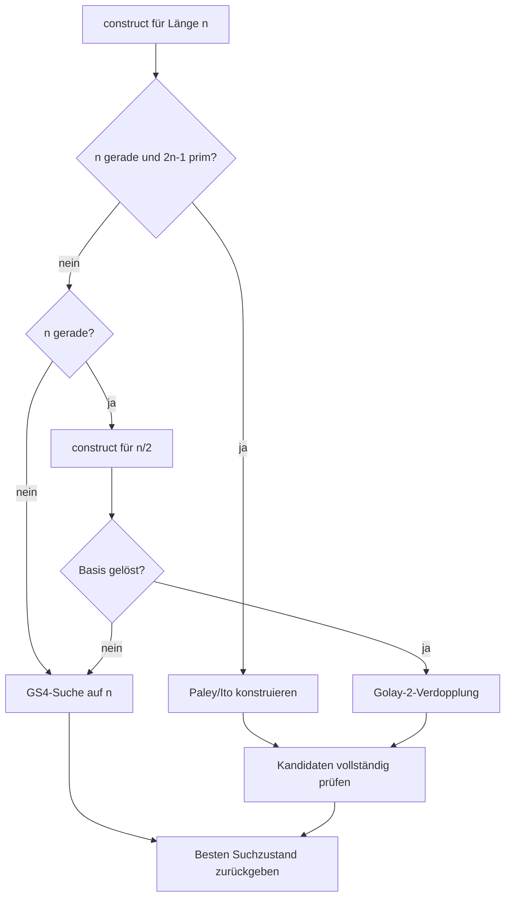

# Exakte Konstruktionen

Konstruktion und Suche sind getrennte Pfade. Eine exakte Konstruktion erzeugt
Folgen mit `Q = 0`, ohne den heuristischen Solver aufzurufen. Der Pipelinepfad
prüft das Ergebnis trotzdem mit denselben Akzeptanzkriterien wie eine gefundene
Lösung.

## Strategien

| Strategie | Verhalten |
| --- | --- |
| `gs4` | immer heuristische Suche |
| `paley-ng` | direkte Paley/Ito-Konstruktion oder Eingabefehler |
| `construct` | direkte Paley/Ito-Konstruktion, rekursive Verdopplung oder Suche |

`--order` bezeichnet die Matrixordnung `4n`. `--sweep` erwartet dagegen die
Folgenlänge `n`.

## Paley/Ito-Pfad

Der implementierte prime-field-Fall gilt genau dann, wenn

$$
n>0,
\qquad
n \text{ gerade},
\qquad
p=2n-1 \text{ prim}.
$$

`paley_ng_sequences(n)` konstruiert deterministisch ein negaperiodisches
Golay-Paar `(a, b)` und liefert das GS4-Tupel

$$
(a,b,a,b).
$$

Seed, Startzustand und Candidate-Budget spielen auf diesem Pfad keine Rolle.
Der aktuelle Regressionstest deckt insbesondere `n = 52`, `p = 103` und damit
eine Hadamard-Matrix der Ordnung 208 ab.

```bash
python run.py --strategy paley-ng --order 208 --no-output
```

Die Implementierung unterstützt nur den Primfall `p = 2n - 1`. Allgemeine
Primzahlpotenzen sind nicht implementiert.

## Turyn-Produkt

Seien `(g, h)` ein gewöhnliches Golay-Paar und `(c, d)` ein geeignetes
negaperiodisches Paar. Mit

$$
g_+ = \frac{g+h}{2},
\qquad
g_- = \frac{g-h}{2}
$$

berechnet `turyn_pair()`

$$
e = c\otimes g_+ + d^R\otimes g_-,
$$

$$
f = d\otimes g_+ - c^R\otimes g_-.
$$

`turyn_gs4()` wendet denselben Faktor getrennt auf die Paare `(a, b)` und
`(c, d)` eines GS4-Tupels an.

Die generischen Funktionen prüfen Form und binäre Ausgabe. Sie beweisen nicht,
dass der erste Faktor ein Golay-Paar oder das Eingangstupel eine GS4-Lösung
ist. Diese mathematischen Vorbedingungen liegen beim Aufrufer. Der
Pipelinepfad prüft das fertige Tupel anschließend vollständig.

## Golay-2-Verdopplung

`double_gs4()` verwendet das feste Golay-Paar

$$
g=(1,-1),
\qquad
h=(1,1).
$$

Damit wird aus einer GS4-Lösung der Länge `n` eine GS4-Lösung der Länge `2n`.
Der aktuelle Testbestand prüft konkret den Lift von `n = 52` nach `n = 104`.

## Tatsächlicher construct-Dispatcher



Der Dispatcher versucht zuerst den direkten Paley/Ito-Pfad. Ist dieser nicht
anwendbar und `n` gerade, ruft er rekursiv `construct(n/2)` auf. Eine gelöste
Basis wird verdoppelt. Andernfalls startet die freie GS4-Suche auf der
ursprünglichen Länge.

Nicht implementiert sind:

- ein Dispatcher über allgemeine Primzahlpotenzen;
- die automatische Faktorisierung über beliebige Golay-Längen;
- Base-Sequence-, T-Sequence- oder TT-Solver;
- eine automatische Wahl zwischen mehreren exakten Produktkonstruktionen.

## Budgetgrenze des rekursiven Pfads

Jeder rekursive `execute()`-Aufruf erhält derzeit ein eigenes vollständiges
Candidate-Budget. Scheitert die Suche auf `n/2` und beginnt danach eine neue
Suche auf `n`, kann die reale Gesamtarbeit das am äußeren Run angegebene Budget
überschreiten. Der verworfene Basislauf wird außerdem nicht in
`RunResult.candidate_evals` des äußeren Laufs eingerechnet.

`construct`-Runs mit fehlgeschlagener Basis dürfen deshalb anhand ihrer
Candidate-Zahl nicht mit direkten `gs4`-Runs verglichen werden. Direkte
Paley/Ito-Konstruktionen und erfolgreiche Verdopplungen melden dagegen korrekt
null beziehungsweise die Arbeit der gelösten Basis.

## Verifikation

Jedes konstruierte Tupel passiert `verify_candidate()`:

1. Form und binäre Werte prüfen;
2. alle negaperiodischen GS4-Residualgleichungen prüfen;
3. die vollständige Matrix der Ordnung `4n` bauen;
4. Zeilennormen und paarweise Orthogonalität unabhängig prüfen.

Erst danach markiert die Pipeline das Ergebnis als verifiziert.

## Literatur

- N. A. Balonin und D. Z. Djokovic, *Negaperiodic Golay pairs and Hadamard
  matrices*, [arXiv:1508.00640](https://arxiv.org/abs/1508.00640)
