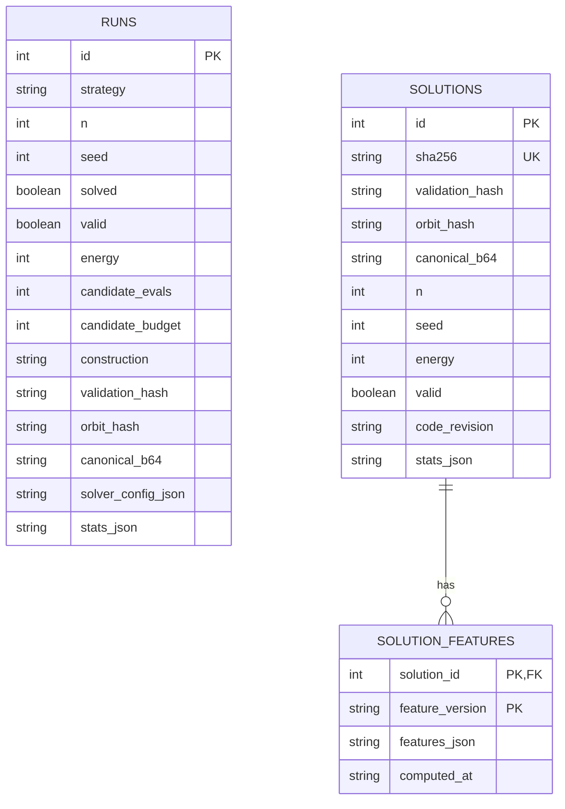
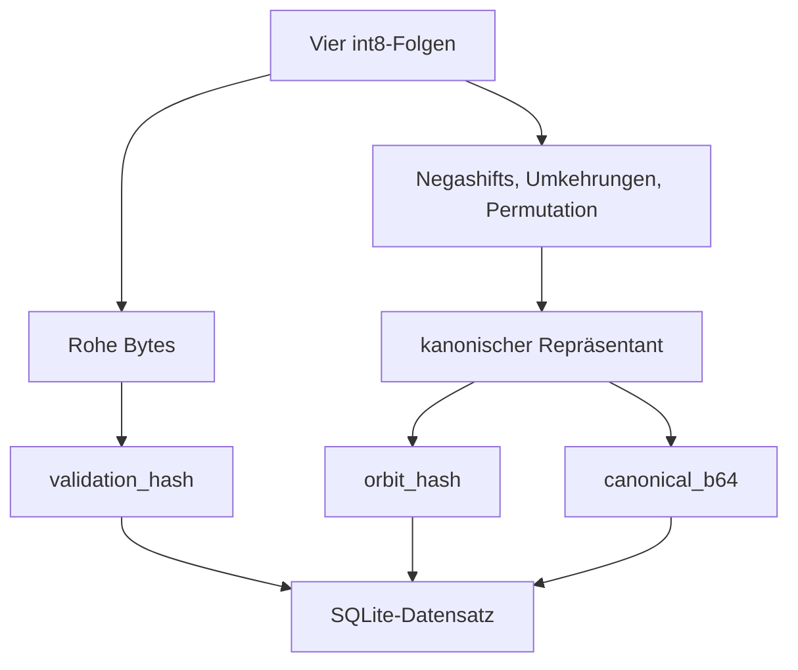

# Experimente und Daten

Ein Solverlauf ist nur dann auswertbar, wenn Instanz, Seed, Budget,
Konfiguration, Codezustand und Akzeptanzprüfung erhalten bleiben. Dieses
Dokument beschreibt den aktuellen Vertrag dafür. Historische Aggregate ohne
Rohartefakt sind kein Teil der kanonischen Evidenz.

## Datenebenen

Die lokale SQLite-Datenbank trennt drei Ebenen:

- `runs` enthält jeden gespeicherten Endzustand, gelöst oder ungelöst;
- `solutions` enthält verifizierte Nullenergie-Zustände, dedupliziert über den
  exakten Payload-Hash;
- `solution_features` enthält neu berechenbare Merkmale mit expliziter
  Feature-Version.



Zwischen `runs` und `solutions` besteht bewusst kein Fremdschlüssel. Ein
ungelöster Run ist ein Experiment, aber keine Lösung. Ein gelöster Run kann
wegen des Unique-Constraints auf dem exakten Hash auf eine bereits bekannte
Lösung treffen.

## Zustandsidentitäten

Jeder gespeicherte Zustand hat zwei verschiedene Identitäten.

### Exakter Zustand

`validation_hash` ist SHA-256 über die rohen `(4, n)`-Bytes im `int8`-Format.
Er identifiziert genau einen gespeicherten Repräsentanten und schützt
`seqs_b64` vor Beschädigung.

### Quick-Orbit

`orbit_hash` ist SHA-256 über einen kanonischen Repräsentanten unter:

- unabhängigen Negashifts der vier Folgen;
- unabhängigen Umkehrungen der vier Folgen;
- Permutation der vier Folgen.

Der Kanonisierer heißt `gs4-quick-orbit-v1`. Dezimation ist nicht Teil dieser
Äquivalenz. `orbit_hash` darf deshalb nicht als vollständige Klassifikation
aller mathematisch äquivalenten Hadamard-Matrizen gelesen werden.

`canonical_b64` speichert den kanonischen Repräsentanten. Der ursprüngliche
Payload wird dadurch nicht ersetzt.



## Speicherung und Prüfung

`save_runs()` schreibt einen Batch in einer Transaktion. Jeder `RunResult`
landet in `runs`. Bei `energy == 0` hat die Pipeline den Kandidaten zuvor über
die Residualgleichungen und die vollständige Matrix geprüft; er wird zusätzlich
mit `INSERT OR IGNORE` in `solutions` gespeichert.

Die Legacy-Spalte `sha256` spiegelt bei neuen Zeilen `validation_hash`. Der
bestehende Unique-Constraint liegt weiterhin auf `sha256`.

```bash
python run.py --check data/hadamard.db
```

Der Datenbank-Audit öffnet die Datei read-only und prüft für jeden Datensatz:

1. Base64 und Payload-Länge;
2. SHA-256 des exakten Zustands;
3. kanonischen Payload und Quick-Orbit;
4. bei als gelöst gespeicherten Zeilen alle GS4-Residualgleichungen.

Der DB-Audit baut nicht für jede gespeicherte Lösung erneut die vollständige
`4n`-Matrix. Dieser teurere unabhängige Matrixaudit liegt an der
Pipeline-Akzeptanzgrenze.

## Candidate-Evaluations

Candidate-Evaluations sind logische Arbeitseinheiten des aktuellen Solvers:

- ein berechneter Greedy-Single-Score zählt 1;
- ein Tabu-Schritt zählt `4n`;
- ein Random Kick zählt 1;
- ein Targeted-Vorschlag zählt 1 plus die Arbeit seines Quenchs.

`candidate_budget` ist das konfigurierte Limit, `candidate_evals` die
tatsächlich berechnete Arbeit. Diese Werte erlauben gepaarte Vergleiche
innerhalb derselben Solverrevision. Sie sind keine hardwareunabhängigen
Operationen und nicht direkt mit Candidate-Zahlen anderer Implementierungen
vergleichbar.

Die rekursive Strategie `construct` hat eine gesonderte Budgetgrenze, die in
[`constructions.md`](constructions.md#budgetgrenze-des-rekursiven-pfads)
beschrieben ist.

## Statistik-Schema v2

`stats_json.stats_schema_version = 2` trennt Arbeit, akzeptierte Übergänge und
Lösungsursprung.

| Gruppe | Felder |
| --- | --- |
| Arbeit | `greedy_candidate_evals`, `tabu_candidate_evals`, `escape_candidate_evals`, `quench_candidate_evals` |
| Übergänge | `greedy_moves`, `tabu_moves`, `random_kicks`, `targeted_quenches`, `quench_moves` |
| Zeit | `greedy_time_s`, `tabu_time_s`, `escape_time_s`, `rebuild_time_s` |
| Lösung | `solve_phase`, `solve_q_before` und phasenspezifische Zähler |

Die Summe der vier Arbeitsfelder ist `total_candidate_evals` und muss dem
verbrauchten Budget entsprechen. Akzeptierte Moves sind keine
Performanceeinheit: Tabu-Moves bleiben beispielsweise gezählt, wenn der Walk
als Ganzes verworfen wird.

## Phasen-Traces

Mit `--trace-phases` speichert der Solver kompakte Ereignisse für

```text
INITIALIZE -> GREEDY -> TABU -> TARGETED oder RANDOM_KICK -> GREEDY
```

Jedes Ereignis enthält unter anderem `Q` vor und nach der Phase, das niedrigste
besuchte `Q`, Candidate-Arbeit, Bewegungsrichtungen sowie exakten und
kanonischen Hash des Endpunkts.

Ein Targeted-Ereignis fasst mehrere verzweigte Starts und verschachtelte
Suchen zusammen. Es ist keine einzelne topologische Kante im Zustandsraum.

## Ablationen

`scripts.ablation` vergleicht Konfigurationen mit denselben Seeds und demselben
Candidate-Budget. Jeder Worker führt vor seiner ersten Messung einen ungetimten
Warm-up mit 10.000 Candidate-Evaluations aus, damit Numba-Kompilation nicht nur
der ersten Konfiguration belastet wird.

```bash
python -m scripts.ablation --targeted --n 43 --n 47 --n 51 \
  --seeds 50 --candidate-budget 6000000 --workers 8 \
  --output runs/targeted-ablation.json
```

Der Greedy-zu-Escape-Handoff lässt sich separat mit identischen Seeds prüfen:

```bash
python -m scripts.ablation --qwindow --n 52 --seeds 1000 \
  --candidate-budget 6000000 --workers 12 \
  --output runs/qwindow-n52-1k-6m.json
```

Primäre Vergleichsgrößen sind:

- Solve-Rate über gepaarte Seeds;
- gesamte Laufzeit pro Lösung einschließlich fehlgeschlagener Runs;
- Lösungen und Quick-Orbits pro Worker-Stunde;
- Candidate-Evaluations pro Lösung;
- Median und p90 nur zusammen mit Solve-Rate und Gesamtkosten.

Dateien unter `runs/` sind lokale Experimentartefakte und werden nicht
versioniert.

## Vergleich mit anderen Solvern

Vor einem Vergleich müssen mindestens feststehen:

- Sequenzfamilie, insbesondere zyklisch oder negazyklisch;
- Folgenlänge `n` und Matrixordnung `4n`;
- Startverteilung und Seedmenge;
- Abbruchregel und Candidate- oder Zeitbudget;
- Code-Revision, Hardware und Workerzahl;
- exakte Verifikation;
- Äquivalenzrelation für die Deduplizierung.

Unterschiedliche Suchräume bleiben getrennte Benchmarkzeilen. Ein besserer
Wert von `Q` ist kein Erfolg, solange er nicht bei gleichem Kostenvertrag zu
mehr verifizierten Lösungen führt.

## Versionierter Lösungskatalog

`data/gs4_solution_catalog_v1.json` ist der erhaltene öffentliche Snapshot.
Er enthält derzeit:

- 794 verifizierte Lösungen;
- 794 verschiedene Quick-Orbits;
- Längen von `n = 31` bis `n = 64`;
- 20 Lösungen bei `n = 52`, darunter eine im implementierten Paley-Orbit.

Der Katalog speichert `gs4-solution-features-v1`, darunter NAF-Signaturen,
Paarseparatoren, Nachbar-Q-Histogramme, Symbolverteilungen, Quick-Orbit-Größe
und Paley-Orbit-Zugehörigkeit.

Zur Neuerzeugung ist eine vorhandene lokale Datenbank erforderlich:

```bash
python -m scripts.analyze_solutions \
  --database data/hadamard.db \
  --output data/gs4_solution_catalog_v1.json
```

Das Skript verweigert den Lauf, wenn die angegebene Datenbank fehlt. Dadurch
kann ein frischer Clone den versionierten Katalog nicht versehentlich durch
einen leeren Snapshot ersetzen.

## Datenbankmigration

```bash
python -m scripts.migrate_database data/hadamard.db
```

Die Migration schreibt fehlende Identitäten und Validierungsfelder in eine
bestehende Datenbank. Sie ist kein read-only Audit. Vor einer Migration einer
nicht reproduzierbaren Datenbank sollte eine Kopie angelegt werden.
