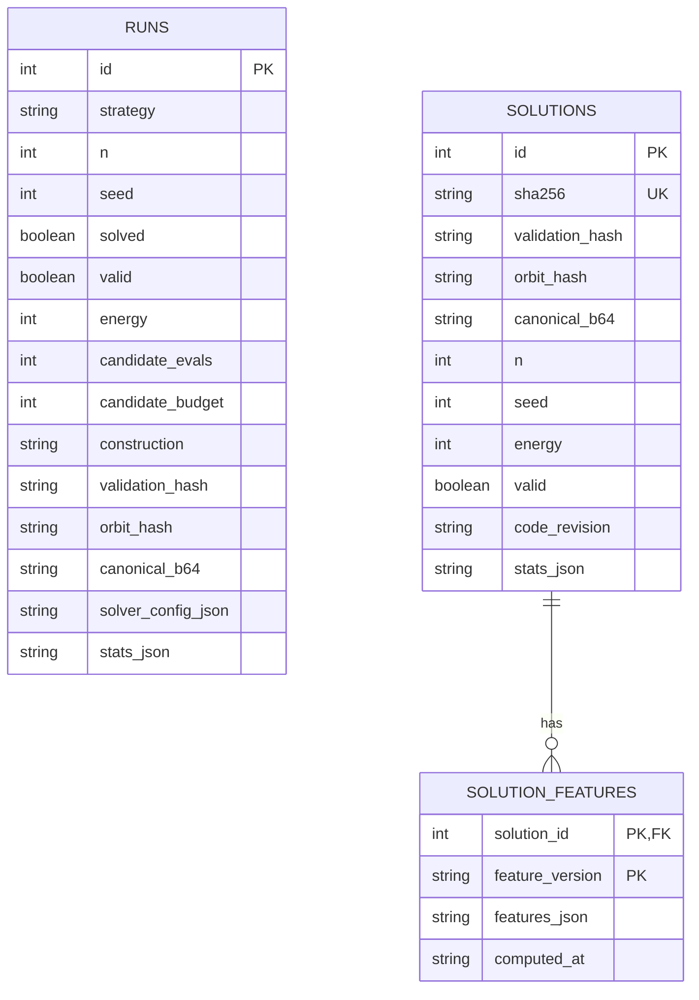
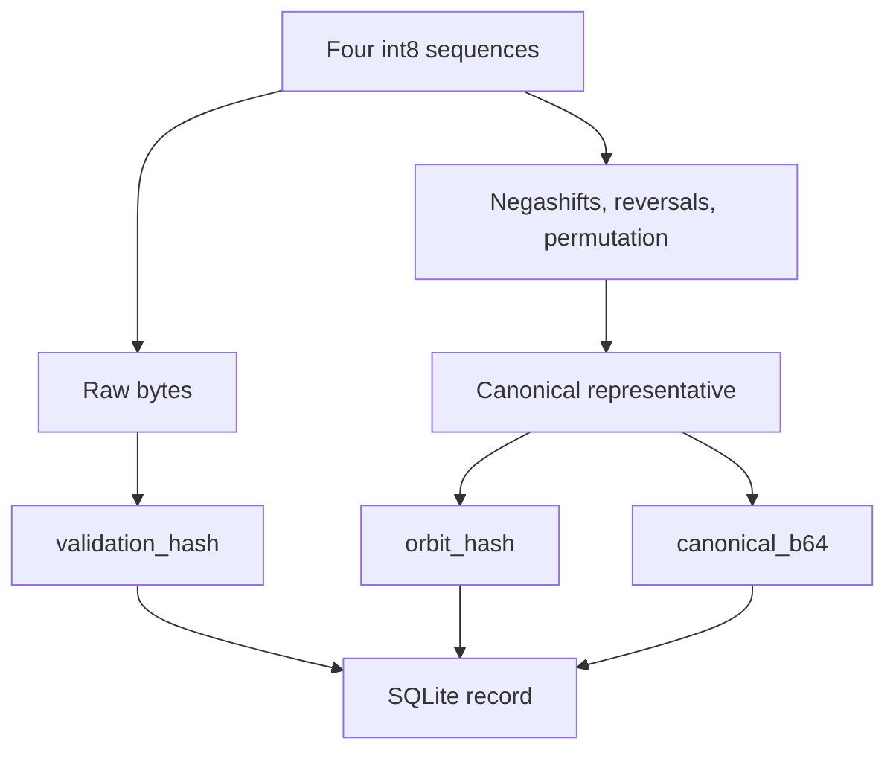

# Experiments and data

Parent: [Documentation index](README.md)

A solver run can be evaluated only if its instance, seed, budget,
configuration, code revision, and acceptance checks are preserved. This
document defines that contract. Historical aggregates without raw artifacts
are not part of the canonical evidence.

## Contents

- [Experiments and data](#experiments-and-data)
  - [Contents](#contents)
  - [Data layers](#data-layers)
  - [State identities](#state-identities)
    - [Exact state](#exact-state)
    - [Quick orbit](#quick-orbit)
  - [Persistence and verification](#persistence-and-verification)
  - [Candidate evaluations](#candidate-evaluations)
  - [Statistics schema v2](#statistics-schema-v2)
  - [Phase traces](#phase-traces)
  - [Ablations](#ablations)
  - [Comparing other solvers](#comparing-other-solvers)
  - [Local solution catalog](#local-solution-catalog)
  - [Sweep plots](#sweep-plots)
  - [Database migration](#database-migration)

## Data layers

The local SQLite database separates three layers:

- `runs` contains every saved final state, solved or unsolved;
- `solutions` contains verified zero-energy states, deduplicated by the exact
  payload hash;
- `solution_features` contains recomputable features with an explicit feature
  version.



There is deliberately no foreign key between `runs` and `solutions`. An
unsolved run is an experiment, but not a solution. A solved run can match an
existing solution because the exact hash has a uniqueness constraint.

## State identities

Each stored state has two distinct identities.

### Exact state

`validation_hash` is the SHA-256 hash of the raw `(4, n)` bytes in `int8`
format. It identifies one exact stored representative and provides an
integrity check for `seqs_b64`.

### Quick orbit

`orbit_hash` is the SHA-256 hash of a canonical representative under:

- independent negashifts of the four sequences;
- independent reversals of the four sequences;
- permutations of the four sequences.

The canonicalizer is named `gs4-quick-orbit-v1`. Decimation is not part of this
equivalence relation. `orbit_hash` therefore does not fully classify all
mathematically equivalent Hadamard matrices.

`canonical_b64` stores the canonical representative without replacing the
original payload.



## Persistence and verification

`save_runs()` writes a batch in one transaction. Every `RunResult` is stored
in `runs`. At `energy == 0`, the pipeline has already checked the candidate
against the residual equations and the full matrix; it is also stored in
`solutions` with `INSERT OR IGNORE`.

For new rows, the legacy `sha256` column mirrors `validation_hash`. The
existing uniqueness constraint remains on `sha256`.

```bash
python run.py --check data/hadamard.db
```

The database audit opens the file read-only and checks each record's:

1. Base64 encoding and payload length;
2. exact-state SHA-256 hash;
3. canonical payload and quick orbit;
4. GS4 residual equations, for rows stored as solved.

The database audit does not rebuild the full `4n` matrix for every stored
solution. That more expensive independent matrix audit belongs to the
[pipeline acceptance boundary](solver.md#pipeline-and-verification).

## Candidate evaluations

Candidate evaluations are logical work units of the current solver:

- a computed greedy single-flip score counts as 1;
- a tabu step counts as `4n`;
- a random kick counts as 1;
- a targeted proposal counts as 1 plus the work of its quench.

`candidate_budget` is the configured limit; `candidate_evals` is the work
actually evaluated. These values support paired comparisons within the same
solver revision. They are not hardware-independent operations or directly
comparable to candidate counts from other implementations.

The recursive `construct` strategy has a separate
[budget limitation](constructions.md#recursive-budget-limitation).

## Statistics schema v2

`stats_json.stats_schema_version = 2` separates work, accepted transitions,
and solution origin.

| Group | Fields |
| --- | --- |
| Work | `greedy_candidate_evals`, `tabu_candidate_evals`, `escape_candidate_evals`, `quench_candidate_evals` |
| Transitions | `greedy_moves`, `tabu_moves`, `random_kicks`, `targeted_quenches`, `quench_moves` |
| Time | `greedy_time_s`, `tabu_time_s`, `escape_time_s`, `rebuild_time_s` |
| Solution | `solve_phase`, `solve_q_before`, and phase-specific counters |

The four work fields sum to `total_candidate_evals`, which must equal the
consumed budget. Accepted moves are not a performance unit: for example,
tabu moves remain counted even if the walk as a whole is discarded.

## Phase traces

With `--trace-phases`, the solver records compact events for

```text
INITIALIZE -> GREEDY -> TABU -> TARGETED or RANDOM_KICK -> GREEDY
```

Each event includes `Q` before and after the phase, the lowest `Q` visited,
candidate work, move directions, and the endpoint's exact and canonical hashes.

A targeted event summarizes several branched starts and nested searches. It
is not a single topological edge in the state space.

## Ablations

`lab.compare` compares configurations using the same seeds and candidate
budget. Before its first measurement, each worker performs an untimed warm-up
of 10,000 candidate evaluations to keep Numba compilation out of the comparison.

```bash
python -m lab.compare --targeted --n 43 --n 47 --n 51 \
  --seeds 50 --candidate-budget 6000000 --workers 8 \
  --output runs/targeted-ablation.json
```

The handoff from greedy search to escape can be tested separately with
identical seeds:

```bash
python -m lab.compare --qwindow --n 52 --seeds 1000 \
  --candidate-budget 6000000 --workers 12 \
  --output runs/qwindow-n52-1k-6m.json
```

To compare quench allocation against the default and disabled targeted escape,
repeat `--quench-budget`. Every arm retains the same total candidate budget:

```bash
python -m lab.compare --quench-budget 100000 --quench-budget 500000 \
  --n 46 --n 50 --n 54 --seeds 1000 --seed-start 42 \
  --candidate-budget 6000000 --workers 12 \
  --output runs/quench-budget-screen.json
```

Use a disjoint seed range for confirmation after selecting a promising setting.
`--seed-start` defaults to zero; `run.py` defaults to seed 42, so set it explicitly
when reproducing a CLI sweep. Quench limits must be positive. The quench comparison,
`--targeted`, and `--qwindow` are mutually exclusive experiment modes.

The primary comparison metrics are:

- solve rate across paired seeds;
- total runtime per solution, including failed runs;
- solutions and quick orbits per worker-hour;
- candidate evaluations per solution;
- median and p90, always reported alongside solve rate and total cost.

Files under `runs/` are local experiment artifacts and are not versioned.

For research controls beyond the named modes, `--configs path.json` accepts a
nonempty JSON object mapping arm names to `SolverConfig` overrides. For example:

```json
{
  "default": {},
  "greedy-to-minimum": {"qwindow_high": 0},
  "no-targeted": {"targeted_escape": false},
  "long-memory": {"targeted_escape": false, "tabu_decay": 0.95}
}
```

This mode is exclusive with the named comparisons. Reports include effective
configurations, Python/platform information and SHA-256 hashes of source files.
Keep the raw report when comparing changes made without a new commit. A dirty
commit label alone cannot identify which implementation produced a result.

## Comparing other solvers

Before comparing results, establish at least:

- the sequence family, particularly cyclic versus negacyclic;
- sequence length `n` and matrix order `4n`;
- the initial-state distribution and seed set;
- the stopping rule and candidate or time budget;
- code revision, hardware, and worker count;
- exact verification;
- the equivalence relation used for deduplication.

Different search spaces belong in separate benchmark rows. A lower `Q` is not
a success unless it produces more verified solutions under the same cost
contract.

## Local solution catalog

The repository does not ship a solution-catalog snapshot. Generate a catalog
from an existing local database:

```bash
python -m lab.catalog \
  --database data/hadamard.db \
  --output runs/solution-catalog.json
```

The catalog uses `gs4-solution-features-v1`. Its features include NAF
signatures, pair separators, neighboring-Q histograms, symbol distributions,
quick-orbit size, and membership in the implemented Paley orbit.

The script refuses to run if the specified database is missing, preventing an
accidental empty catalog from a missing input. Catalog counts and length
coverage depend on the database supplied; retain that database and the code
revision when reporting results.

## Sweep plots

Install development dependencies with `python -m pip install -e ".[dev]"`, then run:

```bash
python -m lab.plot --database data/hadamard.db --output runs/plots
```

Open `runs/plots/README.md` for the generated figures. Each cohort has PNG and SVG
plots plus a CSV summary: solve yield, best-Q percentiles, the full best-Q
distribution and median candidate effort including failures. The `manifest.json`
retains selected records and cohort metadata for reproducibility.

The database is opened read-only and fetched in one query. No search is started.
Only records marked valid are used; this is not a new independent solution audit.
Cohorts separate revision, configuration, strategy, construction, budget and
odd/even lengths. Repeated `(n, seed)` entries within a cohort retain the latest ID
and are counted in the report. No confidence interval assumes these seeds are
independent samples. Missing effort measurements are omitted from effort statistics
and their available count is reported in CSV.

Use `--first-id 6301 --last-id 20300` to select a particular batch. A `-dirty`
revision alone cannot distinguish different uncommitted source trees. The stored
best Q does not reveal when it was reached or how long a run remained there.
Line segments connect sampled lengths and are not a fitted scaling law.

## Database migration

```bash
python -m scripts.migrate_database data/hadamard.db
```

Migration writes missing identities and validation fields to an existing
database. It is not a read-only audit. Copy any database that cannot be
reproduced before migrating it.
