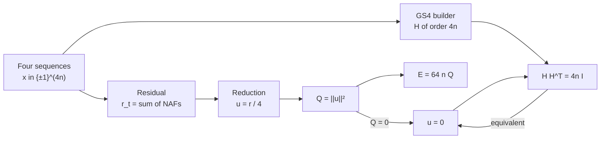
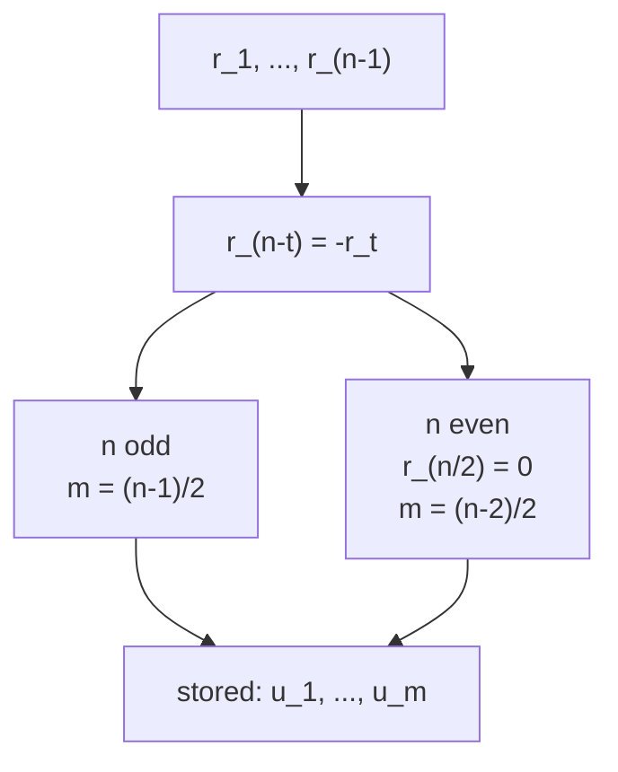
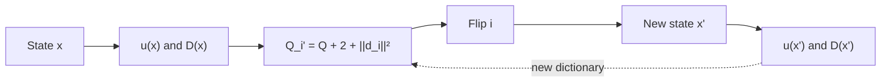

# Mathematics of the GS4 model

Parent: [Documentation index](README.md)

This document describes the solver's exact objective function. It separates
the equations that define the current code from additional structural
identities. Historical experiments and open questions about novelty are
outside the scope of this model.

## Contents

- [Mathematics of the GS4 model](#mathematics-of-the-gs4-model)
  - [Contents](#contents)
  - [Sequences and negaperiodic autocorrelation](#sequences-and-negaperiodic-autocorrelation)
  - [GS4 matrix and Hadamard condition](#gs4-matrix-and-hadamard-condition)
  - [Independent lags and integer reduction](#independent-lags-and-integer-reduction)
  - [Energy and normalization](#energy-and-normalization)
  - [Single-flip operator](#single-flip-operator)
  - [Exact multi-flips](#exact-multi-flips)
  - [Gram matrix of the flip dictionary](#gram-matrix-of-the-flip-dictionary)
  - [Half-length folding for even n](#half-length-folding-for-even-n)
  - [What the model establishes](#what-the-model-establishes)
  - [Code and test references](#code-and-test-references)
  - [References](#references)

## Sequences and negaperiodic autocorrelation

Let

```math
x = (x_0, \ldots, x_{n-1}) \in \{-1,+1\}^n.
```

The antiperiodic extension satisfies

```math
\bar x_{j+n} = -\bar x_j.
```

For $0 \le t < n$, the negaperiodic autocorrelation is

```math
\mathrm{NAF}_x(t)
= \sum_{j=0}^{n-1}\bar x_j\bar x_{j+t}
= \sum_{j=0}^{n-t-1}x_jx_{j+t}
  - \sum_{j=n-t}^{n-1}x_jx_{j+t-n}.
```

For four sequences $x^{(1)},\ldots,x^{(4)}$, the project defines the combined
residual

```math
r_t = \sum_{s=1}^{4}\mathrm{NAF}_{x^{(s)}}(t),
\qquad r_0 = 4n.
```

## GS4 matrix and Hadamard condition

The four sequences define the negacyclic matrices $A,B,C,D$. Using the
backward identity matrix $J$, `src/builder.py` constructs

```math
H =
\begin{bmatrix}
A   & BJ    & CJ    & DJ \\
-BJ & A     & -D^TJ & C^TJ \\
-CJ & D^TJ  & A     & -B^TJ \\
-DJ & -C^TJ & B^TJ  & A
\end{bmatrix}.
```

The following conditions are equivalent:

```math
HH^T = 4nI
\iff
r_t = 0 \quad \text{for } 1 \le t < n.
```

`src/verify.py` checks the residual equations independently of the tracker.
For a zero-energy candidate found through the pipeline, the full GS4 matrix
is also built and checked by a pure-Python row audit.



## Independent lags and integer reduction

Antiperiodic symmetry gives

```math
r_{-t}=r_t,
\qquad
r_{n-t}=-r_t.
```

It therefore suffices to use

```math
m = \left\lfloor\frac{n-1}{2}\right\rfloor
```

independent coordinates. For even $n$, the midpoint lag $r_{n/2}$ is
identically zero.

Each combined residual is divisible by four. For a single sequence,

```math
\mathrm{NAF}_x(t) \equiv n-2t \pmod 4.
```

The sum over four sequences is therefore zero modulo four. The tracker stores

```math
u_t = \frac{r_t}{4},
\qquad
Q = \lVert u\rVert_2^2.
```



## Energy and normalization

The energy used in this repository is the sum of squared inner products over
unordered pairs of distinct matrix rows:

```math
E
= \sum_{i<j}\langle H_i,H_j\rangle^2
= \frac12\lVert HH^T-4nI\rVert_F^2.
```

It equals half the full squared Frobenius defect. For the GS4 residual,
the exact identity is

```math
E
= 2n\sum_{t=1}^{n-1}r_t^2
= 64nQ.
```

Thus,

```math
E=0 \iff Q=0 \iff u=0 \iff HH^T=4nI.
```

This identity is checked against the fully constructed Gram matrix in
`tests/test_tracker.py` and `tests/test_properties.py`.

## Single-flip operator

For each of the $4n$ possible bit flips $i=(s,c)$, let $d_i$ be the change in
the reduced residual. Componentwise,

```math
d_{i,t}
= -\frac12\bar x^{(s)}_c
  \left(\bar x^{(s)}_{c+t}+\bar x^{(s)}_{c-t}\right)
\in \{-1,0,1\}.
```

These rows form the state-dependent flip dictionary

```math
D(x) \in \{-1,0,1\}^{4n\times m}.
```

For a single flip, the exact update is

```math
u' = u+d_i,
```

```math
Q' = Q + 2\langle u,d_i\rangle + \lVert d_i\rVert_2^2.
```

The tracker caches $D$, its row norms, and $u$. After an accepted flip, it
updates all affected entries in $O(n)$.



A smaller $Q$ means a smaller current error. It does not fully describe
which moves will be available in the next state, because $D(x)$ changes with
every flip.

## Exact multi-flips

Repeated flips cancel in pairs. For the remaining flip set $F$, the residual
change consists of the single-flip deltas and corrections for pairs within
the same sequence:

```math
\Delta_Fu
= \sum_{i\in F}d_i
  + \sum_{\substack{i<j\\s_i=s_j}}
    \kappa_{ij}e_{\ell_{ij}}.
```

For $h=|c_i-c_j|$ and $\ell_{ij}=\min(h,n-h)$,

```math
\kappa_{ij}=
\begin{cases}
x_{s,c_i}x_{s,c_j}, & h<n-h,\\
-x_{s,c_i}x_{s,c_j}, & h>n-h.
\end{cases}
```

For the even midpoint $h=n/2$, the correction affects only the identically
zero midpoint lag and is not stored. Flips in different sequences produce
no pair correction.

Then

```math
Q(F)=\lVert u+\Delta_Fu\rVert_2^2,
\qquad
E(F)=64nQ(F).
```

The residual is at most quadratic in the flip indicators. Energy is the
squared norm of this residual and is therefore generally quartic.
`Tracker.combo_energy()` remains exact because it first constructs the full
residual and only then computes its norm.

## Gram matrix of the flip dictionary

With $r$ extended antiperiodically, for independent lags $t$ and $\ell$,

```math
(D^TD)_{t,\ell}
= \frac{r_{\ell-t}+r_{\ell+t}}{2}.
```

The following balance identity also holds:

```math
\sum_i d_i=-4u.
```

Thus, $D^TD$ is fully determined by the current residual. It captures the
aggregate column geometry, but not the assignment of individual rows to the
$4n$ flips.

For $n\ge5$, the tight-frame equivalence is

```math
u=0
\iff
D^TD=2nI_m.
```

The case $n=4$ is an exception: $D^TD=2nI$ can hold even when $Q>0$.

Let $F_D=D^TD-2nI$. For even $n\ge6$,

```math
\lVert F_D\rVert_F^2=4(n-4)Q.
```

For odd $n\ge5$, with

```math
a=\sum_{t=1}^{(n-1)/2}(-1)^tu_t
```

we have

```math
\lVert F_D\rVert_F^2=4(n-4)Q+8a^2.
```

These identities are covered by regression tests in `tests/test_tracker.py`.
The same tests include two states with identical $u$ and $D^TD$ but different
numbers of single flips that immediately solve the problem. A frame potential
therefore does not provide an additional navigation metric.

## Half-length folding for even n

For $n=2h$, split each sequence as $x=(p,q)$ and set

```math
z_j=p_j+iq_j,
\qquad
\omega=e^{i\pi/n},
\qquad
y_j=\omega^jz_j.
```

Define the summed periodic autocorrelation of the four $y$ sequences as

```math
C_t=\sum_{s=0}^{3}\sum_{j=0}^{h-1}
y_j^{(s)}\overline{y_{j+t\bmod h}^{(s)}}.
```

Then, for $1\le t<h$,

```math
C_t=\omega^{-t}(r_t+ir_{h-t})
```

and hence

```math
Q=\frac1{32}\sum_{t=1}^{h-1}|C_t|^2.
```

This representation is exact and checked in `tests/test_tracker.py`. The
current solver does not use it. It halves the sequence length but removes
no binary degrees of freedom.

## What the model establishes

The model provides:

- An exact integer acceptance criterion.
- Exact costs for single flips and multi-flips.
- A compact residual space with approximately `n/2` coordinates.
- A clear distinction between the current error `u` and the state-dependent
  move dictionary `D(x)`.

It provides no polynomial-time construction algorithm, no existence
classification, and no proof that a lower `Q` increases the probability of
eventually finding a solution.

## Code and test references

| Claim | Implementation | Regression tests |
| --- | --- | --- |
| GS4 block matrix | `src/builder.py` | `tests/test_builders.py` |
| Residual, `u`, `Q`, `E` | `src/tracker.py` | `tests/test_tracker.py`, `tests/test_properties.py` |
| Single flips and multi-flips | `src/tracker.py` | `tests/test_tracker.py`, `tests/test_properties.py` |
| Independent verification | `src/verify.py` | `tests/test_verify.py`, `tests/test_pipeline.py` |
| Paley/Ito and doubling | `src/constructions.py` | `tests/test_pipeline.py` |
| Half-length folding | No solver phase | `tests/test_tracker.py` |

## References

- J. M. Goethals and J. J. Seidel, *A skew Hadamard matrix of order 36*,
  [doi:10.1017/S144678870000673X](https://doi.org/10.1017/S144678870000673X)
- N. A. Balonin and D. Z. Djokovic, *Negaperiodic Golay pairs and Hadamard
  matrices*, [arXiv:1508.00640](https://arxiv.org/abs/1508.00640)
