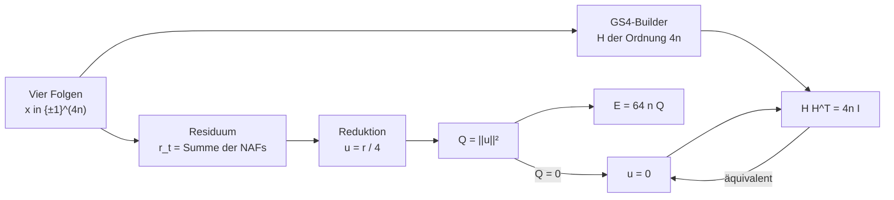
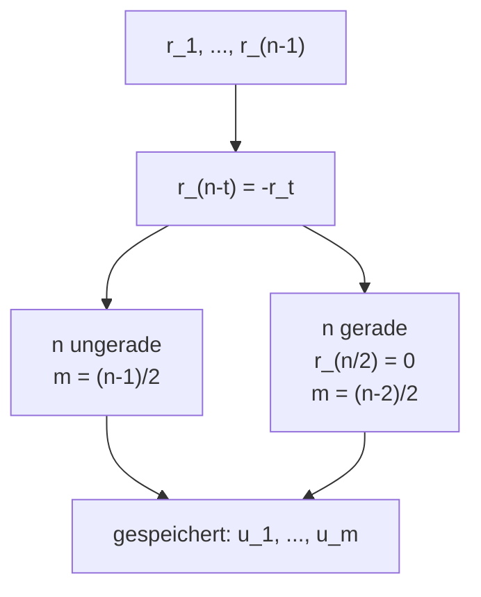
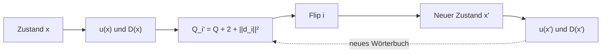

# Mathematik des GS4-Modells

Dieses Dokument beschreibt die exakte Zielfunktion des Solvers. Es trennt
Gleichungen, die den aktuellen Code definieren, von zusätzlichen
Strukturidentitäten. Historische Experimente und offene Neuheitsfragen sind
nicht Teil dieses Modells.

## Folgen und negaperiodische Autokorrelation

Sei

$$
x = (x_0, \ldots, x_{n-1}) \in \{-1,+1\}^n.
$$

Die antiperiodische Fortsetzung erfüllt

$$
\bar x_{j+n} = -\bar x_j.
$$

Für $0 \le t < n$ ist die negaperiodische Autokorrelation

$$
\operatorname{NAF}_x(t)
= \sum_{j=0}^{n-1}\bar x_j\bar x_{j+t}
= \sum_{j=0}^{n-t-1}x_jx_{j+t}
  - \sum_{j=n-t}^{n-1}x_jx_{j+t-n}.
$$

Für vier Folgen $x^{(1)},\ldots,x^{(4)}$ definiert das Projekt das kombinierte
Residuum

$$
r_t = \sum_{s=1}^{4}\operatorname{NAF}_{x^{(s)}}(t),
\qquad r_0 = 4n.
$$

## GS4-Matrix und Hadamard-Bedingung

Aus den vier Folgen entstehen die negazyklischen Matrizen $A,B,C,D$. Mit der
Rückwärts-Identität $J$ baut `src/builder.py` die Matrix

$$
H =
\begin{bmatrix}
A   & BJ    & CJ    & DJ \\
-BJ & A     & -D^TJ & C^TJ \\
-CJ & D^TJ  & A     & -B^TJ \\
-DJ & -C^TJ & B^TJ  & A
\end{bmatrix}.
$$

Die folgenden Bedingungen sind äquivalent:

$$
HH^T = 4nI
\iff
r_t = 0 \quad \text{für } 1 \le t < n.
$$

`src/verify.py` prüft die Residualgleichungen unabhängig vom Tracker. Ein im
Pipelinepfad gefundener Nullenergie-Kandidat wird zusätzlich als vollständige
GS4-Matrix aufgebaut und mit einem reinen Python-Zeilenaudit geprüft.

## Unabhängige Lags und ganzzahlige Reduktion

Die antiperiodische Symmetrie liefert

$$
r_{-t}=r_t,
\qquad
r_{n-t}=-r_t.
$$

Damit genügen

$$
m = \left\lfloor\frac{n-1}{2}\right\rfloor
$$

unabhängige Koordinaten. Für gerades $n$ ist der Mittelpunkt-Lag $r_{n/2}$
identisch null.

Jedes kombinierte Residuum ist durch vier teilbar. Für eine einzelne Folge
gilt

$$
\operatorname{NAF}_x(t) \equiv n-2t \pmod 4.
$$

Die Summe über vier Folgen ist daher null modulo vier. Der Tracker speichert

$$
u_t = \frac{r_t}{4},
\qquad
Q = \lVert u\rVert_2^2.
$$

## Energie und Normierung

Die Repository-Energie ist die Summe der quadrierten Skalarprodukte über
ungeordnete Paare verschiedener Matrixzeilen:

$$
E
= \sum_{i<j}\langle H_i,H_j\rangle^2
= \frac12\lVert HH^T-4nI\rVert_F^2.
$$

Sie ist nicht der volle Frobeniusdefekt, sondern dessen Hälfte. Für das
GS4-Residuum gilt exakt

$$
E
= 2n\sum_{t=1}^{n-1}r_t^2
= 64nQ.
$$

Damit sind

$$
E=0 \iff Q=0 \iff u=0 \iff HH^T=4nI.
$$

Diese Identität wird in `tests/test_tracker.py` und
`tests/test_properties.py` gegen die vollständig gebaute Gram-Matrix geprüft.

## Single-Flip-Operator

Für jeden der $4n$ möglichen Bitflips $i=(s,c)$ sei $d_i$ die Änderung des
reduzierten Residuums. Komponentenweise gilt

$$
d_{i,t}
= -\frac12\bar x^{(s)}_c
  \left(\bar x^{(s)}_{c+t}+\bar x^{(s)}_{c-t}\right)
\in \{-1,0,1\}.
$$

Die Zeilen bilden das zustandsabhängige Flip-Wörterbuch

$$
D(x) \in \{-1,0,1\}^{4n\times m}.
$$

Für einen Flip gilt exakt

$$
u' = u+d_i,
$$

$$
Q' = Q + 2\langle u,d_i\rangle + \lVert d_i\rVert_2^2.
$$

Der Tracker hält $D$, die Zeilennormen und $u$ im Cache. Nach einem
akzeptierten Flip aktualisiert er alle betroffenen Einträge in $O(n)$.

Ein kleineres $Q$ beschreibt einen kleineren aktuellen Fehler. Es beschreibt
nicht vollständig, welche Moves im nächsten Zustand verfügbar sein werden,
weil sich $D(x)$ mit jedem Flip ändert.

## Exakte Multi-Flips

Wiederholt auftretende Flips heben sich paarweise auf. Für die verbleibende
Flipmenge $F$ setzt sich die Residualänderung aus den Single-Deltas und
Korrekturen für Paare innerhalb derselben Folge zusammen:

$$
\Delta_Fu
= \sum_{i\in F}d_i
  + \sum_{\substack{i<j\\s_i=s_j}}
    \kappa_{ij}e_{\ell_{ij}}.
$$

Für $h=|c_i-c_j|$ und $\ell_{ij}=\min(h,n-h)$ ist

$$
\kappa_{ij}=
\begin{cases}
x_{s,c_i}x_{s,c_j}, & h<n-h,\\
-x_{s,c_i}x_{s,c_j}, & h>n-h.
\end{cases}
$$

Beim geraden Mittelpunkt $h=n/2$ liegt die Korrektur ausschließlich im
identisch verschwindenden Mittelpunkt-Lag und wird nicht gespeichert. Flips in
verschiedenen Folgen erzeugen keine Paarkorrektur.

Danach gilt

$$
Q(F)=\lVert u+\Delta_Fu\rVert_2^2,
\qquad
E(F)=64nQ(F).
$$

Das Residuum ist höchstens quadratisch in den Flipindikatoren. Die Energie ist
die quadrierte Norm dieses Residuums und deshalb im Allgemeinen quartisch.
`Tracker.combo_energy()` bleibt exakt, weil die Methode zuerst das vollständige
Residuum konstruiert und erst danach seine Norm bildet.

## Grammatrix des Flip-Wörterbuchs

Mit antiperiodisch fortgesetztem $r$ gilt für unabhängige Lags $t$ und $\ell$

$$
(D^TD)_{t,\ell}
= \frac{r_{\ell-t}+r_{\ell+t}}{2}.
$$

Außerdem gilt die Balanceidentität

$$
\sum_i d_i=-4u.
$$

Damit ist $D^TD$ vollständig durch das aktuelle Residuum bestimmt. Es enthält
die aggregierte Spaltengeometrie, aber nicht die Zuordnung der konkreten Zeilen
zu den $4n$ Flips.

Für $n\ge5$ gilt die Tight-Frame-Äquivalenz

$$
u=0
\iff
D^TD=2nI_m.
$$

Der Fall $n=4$ ist eine Ausnahme: Dort kann $D^TD=2nI$ auch bei $Q>0$ gelten.

Setze $F_D=D^TD-2nI$. Für gerades $n\ge6$ gilt

$$
\lVert F_D\rVert_F^2=4(n-4)Q.
$$

Für ungerades $n\ge5$ und

$$
a=\sum_{t=1}^{(n-1)/2}(-1)^tu_t
$$

gilt

$$
\lVert F_D\rVert_F^2=4(n-4)Q+8a^2.
$$

Diese Identitäten sind Regressionstests in `tests/test_tracker.py`. Derselbe
Testbestand enthält zwei Zustände mit identischem $u$ und identischem $D^TD$,
aber unterschiedlicher Zahl direkt lösender Single-Flips. Ein Framepotential
ist deshalb keine zusätzliche Navigationsmetrik.

## Halb-Längen-Faltung für gerades n

Für $n=2h$ zerlege jede Folge als $x=(p,q)$ und setze

$$
z_j=p_j+iq_j,
\qquad
\omega=e^{i\pi/n},
\qquad
y_j=\omega^jz_j.
$$

Definiere die summierte periodische Autokorrelation der vier $y$-Folgen als

$$
C_t=\sum_{s=0}^{3}\sum_{j=0}^{h-1}
y_j^{(s)}\overline{y_{j+t\bmod h}^{(s)}}.
$$

Dann gilt für $1\le t<h$

$$
C_t=\omega^{-t}(r_t+ir_{h-t})
$$

und damit

$$
Q=\frac1{32}\sum_{t=1}^{h-1}|C_t|^2.
$$

Diese Darstellung ist exakt und in `tests/test_tracker.py` geprüft. Der
aktuelle Solver verwendet sie nicht. Sie halbiert die Folgenlänge, entfernt
aber keine binären Freiheitsgrade.

## Was das Modell aussagt

Das Modell liefert:

- ein exaktes, ganzzahliges Akzeptanzkriterium;
- exakte Kosten für Single- und Multi-Flips;
- einen kompakten Residualraum mit ungefähr `n/2` Koordinaten;
- eine klare Trennung zwischen aktuellem Fehler `u` und dem
  zustandsabhängigen Move-Wörterbuch `D(x)`.

Es liefert keinen polynomialen Konstruktionsalgorithmus, keine
Existenzklassifikation und keinen Beweis, dass ein niedrigeres `Q` zu einer
höheren späteren Solve-Wahrscheinlichkeit führt.

## Code- und Testanker

| Aussage | Implementierung | Regression |
| --- | --- | --- |
| GS4-Blockmatrix | `src/builder.py` | `tests/test_builders.py` |
| Residuum, `u`, `Q`, `E` | `src/tracker.py` | `tests/test_tracker.py`, `tests/test_properties.py` |
| Single- und Multi-Flips | `src/tracker.py` | `tests/test_tracker.py`, `tests/test_properties.py` |
| unabhängige Verifikation | `src/verify.py` | `tests/test_verify.py`, `tests/test_pipeline.py` |
| Paley/Ito und Verdopplung | `src/constructions.py` | `tests/test_pipeline.py` |
| Halb-Längen-Faltung | keine Solverphase | `tests/test_tracker.py` |

## Literatur

- J. M. Goethals und J. J. Seidel, *A skew Hadamard matrix of order 36*,
  [doi:10.1017/S144678870000673X](https://doi.org/10.1017/S144678870000673X)
- N. A. Balonin und D. Z. Djokovic, *Negaperiodic Golay pairs and Hadamard
  matrices*, [arXiv:1508.00640](https://arxiv.org/abs/1508.00640)
