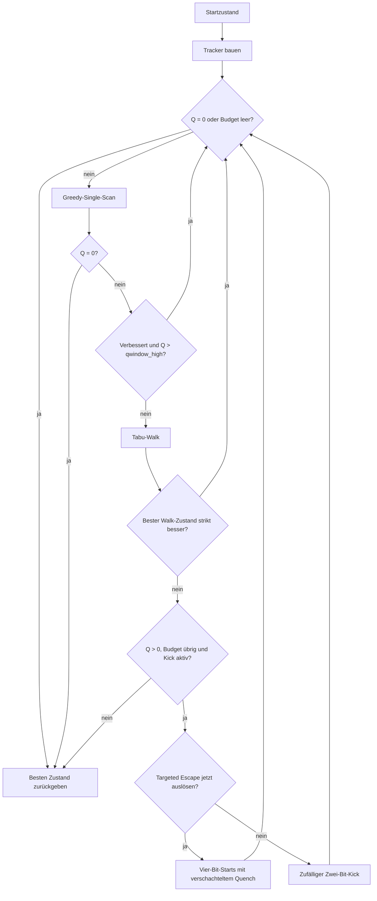

# Aktueller Solver

Der Solver sucht in vier binären Folgen der Länge `n`. Er besitzt keine
Verantwortung für CLI-Parsing, exakte Konstruktionen, SQLite oder die
abschließende Matrixprüfung. Seine Eingabe ist ein Startzustand, ein
`CandidateBudget` und eine `SolverConfig`; seine Ausgabe ist der beste während
des Laufs gefundene Zustand.

Die mathematische Zielfunktion ist in [`mathematics.md`](mathematics.md)
hergeleitet.

## Zustandsfluss



Ist Tabu oder Kick deaktiviert, überspringt der Kontrollfluss die jeweilige
Phase. Der Solver hält getrennt den aktuellen Zustand und den besten jemals
gesehenen Zustand. Zurückgegeben wird immer der beste.

## Konfiguration

`SolverConfig` hat im aktuellen Checkout diese Defaults:

| Option | Default | Bedeutung |
| --- | ---: | --- |
| `kick` | `True` | erlaubt Escape-Phasen |
| `tabu` | `True` | aktiviert den Tabu-Walk |
| `tabu_steps` | `400` | maximale Schritte pro Walk |
| `tabu_tenure` | `5.0` | anfängliche weiche Tabu-Strafe |
| `tabu_decay` | `0.7` | multiplikativer Abbau der Strafe |
| `tabu_noise` | `0.2` | zufälliger Score-Anteil |
| `geo_weight` | `0.0` | optionale Gewichtung der Delta-Norm |
| `targeted_escape` | `True` | erlaubt einen Targeted Escape pro Suche |
| `escape_quench_budget` | `10_000_000` | Budget pro verschachteltem Quench |
| `qwindow_high` | `9` | empirischer Greedy-zu-Escape-Handoff |
| `trace_phases` | `False` | speichert detaillierte Phasenereignisse |

Die CLI stellt alle Optionen außer `qwindow_high` direkt bereit.

## Trackerzustand

`Tracker.build()` berechnet aus den Folgen:

- das reduzierte Residuum `u`;
- `Q = ||u||²` und `E = 64nQ`;
- alle `4n` Single-Flip-Deltas als `int8`;
- die quadrierten Delta-Normen;
- die Geometrie für inkrementelle Cache-Updates.

Ein akzeptierter Flip aktualisiert denselben Trackerzustand. Tabu speichert bei
einem neuen Walk-Bestwert einen vollständigen Snapshot aus Folgen, `u`, `Q`,
Delta-Cache und Normen. Bei Übernahme muss dieser Snapshot exakt einem frischen
Tracker-Build entsprechen; das ist durch Regressionstests abgesichert.

## Greedy-Phase

Der Greedy-Scan besucht Flips in `sequence-major` Reihenfolge. Er bewertet
zusammenhängende Batches von höchstens 64 Single-Flips.

Bei `geo_weight = 0` übernimmt der Solver den ersten verbessernden Flip im
ersten erfolgreichen Batch. Er sucht nicht global nach dem besten Single-Flip.
Mit positiver Geometriegewichtung wählt er innerhalb des ersten erfolgreichen
Batches den niedrigsten gewichteten Score.

Nach einem verbessernden Greedy-Schritt bei `Q > qwindow_high` beginnt der
nächste Greedy-Scan. Bei `Q <= qwindow_high` setzt der Solver das Erfolgsflag
zurück. Mit der Standardkonfiguration folgt dadurch unmittelbar Tabu; ohne
Tabu kann stattdessen der Kick-Pfad folgen. Ein lokales Minimum führt unabhängig
von der Schwelle zu den Escape-Phasen. Tabu selbst ist nicht auf den Bereich
unterhalb der Schwelle beschränkt.

### Warum der Default 9 ist

`9` ist ein historischer Tuningwert, keine mathematische Schranke. Exakt gilt
nur: Ein unmittelbar lösender Single-Flip hat Delta `d = -u` und der Zustand
davor damit `Q = ||d||²`. In den damaligen Traces für `n = 44` lagen 133 von
136 solchen Pre-Solve-Zuständen bei `Q = 4..9`. Eine spätere gepaarte
Ablation bei `n = 40, 44, 48` zeigte keinen konsistenten Vorteil
dimensionsabhängiger, höherer Schwellen; bei `n = 48` war die breiteste
Variante sogar schlechter.

Die historischen Ablationsskripte und Rohdaten sind nicht mehr im Repository.
Die Zahl begrenzt weder den Zustandsraum noch die Erreichbarkeit einer Lösung.
Eine Änderung des Defaults braucht deshalb eine neue gepaarte Ablation unter
der heutigen Candidate-Budget-Semantik.

## Tabu-Walk

Jeder Tabu-Schritt bewertet alle `4n` Single-Flips. Für Kandidat `i` verwendet
der Numba-Kernel den Score

$$
Q_i'\left(1+\operatorname{tabu}_i+\operatorname{noise}_i\right).
$$

Tabu ist damit eine weiche multiplikative Strafe, kein hartes Verbot. Der Walk
darf bergab, seitwärts und bergauf gehen. Er merkt sich den besten exakten
Zustand, übernimmt ihn nach dem Walk aber nur bei strikter Verbesserung
gegenüber dem Startzustand des Walks.

Die gezählten `tabu_moves` sind tatsächlich ausgeführte Walk-Schritte. Sie
bleiben in der Statistik, auch wenn der gesamte Walk später verworfen wird.

## Targeted Escape

Der Targeted Escape wird höchstens einmal pro Suche ausgelöst. Voraussetzung
ist, dass der Solver sein bisher niedrigstes `Q` zum zweiten Mal ohne weiteren
Fortschritt erreicht.

Für jeden verletzten Lag `k` sucht der Solver pro Folge höchstens fünf Flips
mit

$$
d_{s,c,k}=-u_k.
$$

Er kombiniert je einen Flip aus allen vier Folgen und verteilt höchstens 625
Vier-Bit-Kandidaten über die verfügbaren Lags. Jeder Kandidat startet eine
eigene verschachtelte Suche.

Das ist keine lokale Reparatur. Weil die vier Flips aus verschiedenen Folgen
stammen, gilt am ausgewählten Lag zunächst

$$
u'_k=u_k-4u_k=-3u_k.
$$

Der Vorschlag verschlechtert diesen Anteil gezielt. Der anschließende Quench
soll ein anderes Einzugsgebiet erreichen.

Ein ungelöster Quench ersetzt den aktuellen Hauptzustand nicht. Ein darin
gefundener besserer Zustand kann lediglich den globalen Bestzustand
aktualisieren. Der verschachtelte Solver verwendet
`SolverConfig(targeted_escape=False)`; andere äußere Konfigurationswerte werden
nicht übernommen.

## Random Kick

Wenn Targeted Escape nicht ausgelöst wird, wählt der Solver zwei verschiedene
Folgen und je eine zufällige Spalte. Beide Bits werden geflippt. Der neue
Zustand wird auch bei höherer Energie übernommen; anschließend beginnt der
Greedy-Abstieg erneut.

## Candidate-Budget

`candidate_budget` zählt logische Kandidatenauswertungen. Diese Einheiten sind
innerhalb derselben Solverrevision vergleichbar, aber nicht mit CPU-Zyklen oder
Kandidaten anderer Implementierungen gleichzusetzen.

| Arbeit | Kosten |
| --- | ---: |
| berechneter Greedy-Single-Score | 1 |
| ein Tabu-Schritt | `4n` |
| ein Random Kick | 1 |
| ein Vier-Bit-Targeted-Kandidat | 1 |
| verschachtelter Quench | seine eigenen Kandidatenauswertungen |
| Tracker-Build und Anfangszustand | 0 |

Ein Greedy-Batch kann bis zu 64 Einheiten kosten, obwohl der Solver daraus nur
einen Flip übernimmt. `CandidateBudget.take()` begrenzt jeden Schritt auf das
verbleibende Budget. Die Suche endet bei `Q = 0` oder wenn kein Budget mehr
verfügbar ist.

## Pipeline und Verifikation

`src/pipeline.py` verbindet Konstruktion, Suche und Akzeptanz:

1. Eine exakte Strategie wird direkt konstruiert und geprüft.
2. Andernfalls erzeugt `src/generator.py` einen zufälligen oder zyklischen
   Startzustand.
3. `src/solver.py` liefert den besten gefundenen Zustand.
4. Nur bei `Q = 0` prüft `verify_candidate()` die Residualgleichungen, baut die
   vollständige Matrix und führt den unabhängigen Zeilenaudit aus.
5. `src/output.py` kann danach jeden Lauf in `runs` speichern. Verifizierte
   Nullenergie-Ergebnisse werden zusätzlich in `solutions` dedupliziert.

Ein ungelöster Endzustand ist ein gültiges Experimentergebnis, aber keine
Hadamard-Matrix.

## CLI-Beispiele

Ein einzelner Lauf:

```bash
python run.py --strategy gs4 --order 128 --candidate-budget 6000000 --seed 42
```

Ein paralleler Sweep:

```bash
python run.py --sweep gs4 40 44 52 --seeds 100 --candidate-budget 6000000 --workers 12
```

Phasenereignisse für spätere Analyse speichern:

```bash
python run.py --strategy gs4 --order 208 --candidate-budget 6000000 --trace-phases
```

Die vollständige CLI ist mit `python run.py --help` verfügbar.

## Modulverantwortung

| Modul | Verantwortung |
| --- | --- |
| `run.py` | CLI, Worker, Fortschritt, Ausgabe und DB-Audit |
| `src/generator.py` | Strategien und Startzustände |
| `src/pipeline.py` | End-to-End-Ausführung und Akzeptanzgrenze |
| `src/tracker.py` | exakte Energie und Flip-Caches |
| `src/solver.py` | heuristischer Suchzustandsautomat |
| `src/builder.py` | reine GS4-Matrixkonstruktion |
| `src/verify.py` | Residual-, Matrix- und Datenbankprüfung |
| `src/output.py` | SQLite-Persistenz |
