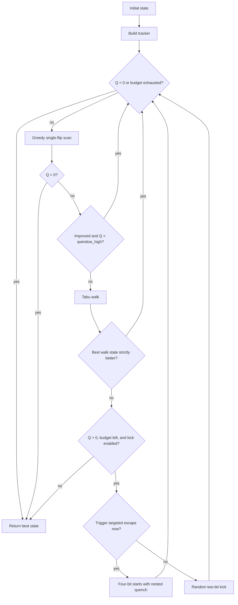

# Solver

Parent: [Documentation index](README.md)

The solver searches four binary sequences of length `n`. It does not parse CLI
arguments, perform exact constructions, manage SQLite, or run the final matrix
audit. It takes an initial state, a `CandidateBudget`, and a `SolverConfig`, then
returns the best state found during the search.

The objective function is derived in [Mathematics](mathematics.md).

## Contents

- [Solver](#solver)
  - [Contents](#contents)
  - [State flow](#state-flow)
  - [Configuration](#configuration)
  - [Tracker state](#tracker-state)
  - [Greedy phase](#greedy-phase)
    - [Why the default is 9](#why-the-default-is-9)
  - [Tabu walk](#tabu-walk)
  - [Targeted escape](#targeted-escape)
  - [Random kick](#random-kick)
  - [Candidate budget](#candidate-budget)
  - [Pipeline and verification](#pipeline-and-verification)
  - [CLI examples](#cli-examples)
  - [Module ownership](#module-ownership)

## State flow



Disabling tabu or kick skips the corresponding phase. The solver keeps the
current state separate from the best state seen so far. It always returns the
best state.

## Configuration

`SolverConfig` has these defaults:

| Option | Default | Meaning |
| --- | ---: | --- |
| `kick` | `True` | Allow escape phases |
| `tabu` | `True` | Enable the tabu walk |
| `tabu_steps` | `400` | Maximum steps per walk |
| `tabu_tenure` | `5.0` | Initial soft tabu penalty |
| `tabu_decay` | `0.7` | Multiplicative penalty decay |
| `tabu_noise` | `0.2` | Random contribution to the score |
| `geo_weight` | `0.0` | Optional weighting of the delta norm |
| `targeted_escape` | `True` | Allow one targeted escape per search |
| `targeted_selection` | `"legacy"` | Legacy, randomized, or full-residual-ranked proposals |
| `tabu_accept_equal` | `False` | Continue from a changed equal-best tabu snapshot |
| `escape_quench_budget` | `10_000_000` | Budget per nested quench |
| `qwindow_high` | `9` | Empirical threshold for handing off from greedy to escape |
| `trace_phases` | `False` | Record detailed phase events |

The main CLI exposes every option except `qwindow_high`, `targeted_selection` and
`tabu_accept_equal` directly. Research options can be supplied through the
[ablation runner's custom configurations](experiments.md#ablations).

## Tracker state

`Tracker.build()` computes the following from the sequences:

- the reduced residual `u`;
- `Q = ||u||²` and `E = 64nQ`;
- all `4n` single-flip deltas as `int8`;
- the squared delta norms;
- the geometry used for incremental cache updates.

An accepted flip updates the same tracker state. Whenever the tabu walk reaches
a new best state, it saves a complete snapshot of the sequences, `u`, `Q`, delta
cache, and norms. An adopted snapshot must match a fresh tracker build exactly;
regression tests cover this invariant.

## Greedy phase

The greedy scan evaluates all affordable single flips in sequence-major order.
It first selects any directly solving flip, even if an earlier flip also improves Q.

Without a direct solution and with `geo_weight = 0`, it accepts the first improving
flip. With positive geometry weighting, it retains the lowest weighted score in
the first successful group of 64 positions. The complete scored prefix is charged
in either case. A partial remaining budget can leave later flips unexamined.

After an improving greedy step at `Q > qwindow_high`, another greedy scan
begins. At `Q <= qwindow_high`, the solver resets the success flag. With the
default configuration, this leads directly to tabu; without tabu, the kick
path may follow instead. A local minimum leads to the escape phases regardless
of the threshold. The tabu walk itself is not restricted to states below the
threshold.

### Why the default is 9

`9` is an empirical tuning value, not a mathematical bound. The exact statement
is narrower: a single flip that immediately solves a state has delta `d = -u`,
so the state before that flip satisfies `Q = ||d||²`.

The historical tuning scripts and raw measurements are no longer available in
the repository, so they do not provide reproducible evidence for the default.
The threshold limits neither the state space nor the reachability of a
solution. Changing it requires a new paired ablation under the current
[candidate-budget contract](experiments.md#candidate-evaluations).

## Tabu walk

Each tabu step evaluates all `4n` single flips. For candidate `i`, the Numba
kernel uses the score

```math
Q_i'\left(1+\mathrm{tabu}_i+\mathrm{noise}_i\right).
```

Tabu is a soft multiplicative penalty, not a hard prohibition. The walk can
move downhill, sideways, or uphill. It tracks the best exact state visited,
but adopts that state after the walk only if it strictly improves on the
walk's starting state.

With experimental `tabu_accept_equal=True`, the latest changed equal-best state
may also be adopted. This continues the outer search without counting a strict
energy improvement. Full tracker caches are adopted together. The global best
energy remains separate from the current search state.

`tabu_moves` counts steps actually taken during the walk. They remain in the
statistics even when the entire walk is later discarded.

## Targeted escape

Targeted escape runs at most once per search. It requires the solver to reach
its lowest `Q` so far for a second time without further progress.

For each violated lag `k`, the solver finds at most five flips per sequence
satisfying

```math
d_{s,c,k}=-u_k.
```

It combines one flip from each of the four sequences and distributes at most
625 four-bit candidates across the available lags. Each candidate starts its
own nested search.

This is not a local repair. Because the four flips affect different sequences,
the selected lag initially becomes

```math
u'_k=u_k-4u_k=-3u_k.
```

The proposal deliberately worsens this residual component. The subsequent
quench is intended to reach a different basin of attraction.

The legacy selector takes the first five matching columns. Experimental `random`
selection samples those columns without replacement. `residual` ranks the sampled
proposal pool by full post-flip Q. Since the four flips affect different sequences,
their cached residual changes add exactly. Every ranked candidate costs one outer
budget evaluation, in addition to proposal initialization and quench work. Lower
post-flip Q is not known to imply higher downstream solution probability.

An unsolved quench does not replace the main search's current state. A better
state found within it can only update the global best state. The nested solver
uses `SolverConfig(targeted_escape=False)`; it does not inherit the other
configuration values from the outer search.

## Random kick

When targeted escape is not triggered, the solver chooses two distinct
sequences and a random column in each, then flips both bits. It accepts the
new state even if its energy is higher, then resumes greedy descent.

## Candidate budget

`candidate_budget` counts logical candidate evaluations. These units are
comparable within the same solver revision, but are not CPU cycles or
interchangeable with candidate counts from other implementations.

| Work | Cost |
| --- | ---: |
| Computed greedy single-flip score | 1 |
| One tabu step | `4n` |
| One random kick | 1 |
| One four-bit targeted candidate | 1 |
| Nested quench | Its own candidate evaluations |
| Tracker build and initial state | 0 |

A greedy scan may cost up to `4n` units even though the solver accepts only one
flip from it. `CandidateBudget.take()` limits each step to the remaining
budget. Search ends at `Q = 0` or when no budget remains.

## Pipeline and verification

`src/pipeline.py` connects construction, search, and acceptance:

1. An exact strategy is constructed and verified directly.
2. Otherwise, `src/generator.py` produces a random or cyclic initial state.
3. `src/solver.py` returns the best state found.
4. Only at `Q = 0` does `verify_candidate()` check the residual equations,
   construct the full matrix, and run the independent row audit.
5. `src/output.py` can then save every run in `runs`. Verified zero-energy
   results are also deduplicated in `solutions`.

An unsolved final state is a valid experiment result, but not a Hadamard matrix.
See [Experiments and data](experiments.md) for persistence and audit contracts.

## CLI examples

Run a single search:

```bash
python run.py --strategy gs4 --order 128 --candidate-budget 6000000 --seed 42
```

Run a parallel sweep:

```bash
python run.py --sweep gs4 40 44 52 --seeds 100 --candidate-budget 6000000 --workers 12
```

Record phase events for later analysis:

```bash
python run.py --strategy gs4 --order 208 --candidate-budget 6000000 --trace-phases
```

Use `python run.py --help` for the complete CLI.

## Module ownership

See [Architecture: ownership](architecture.md#ownership) for module
responsibilities and boundaries.
